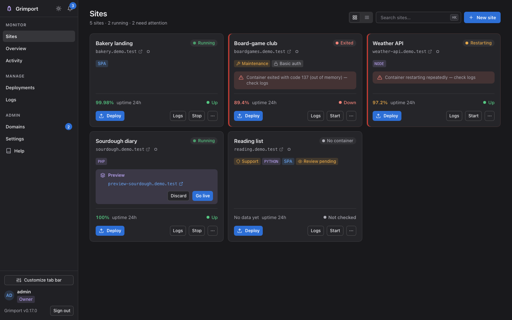

# Grimport

> Self-hosted static site publishing panel — deploy any static site in seconds via drag-and-drop or API.

[](https://github.com/boeldner/grimport/releases)
[](https://github.com/boeldner/grimport/pkgs/container/grimport)
[](LICENSE)



---

## What is Grimport?

Grimport manages static sites on your own server. Each site gets its own isolated **nginx:alpine** container. **Traefik** handles routing and SSL. You control everything through a clean web panel — no SSH, no config files, no YAML.

It's built for:
- Webflow exports, Astro, Next.js static output, plain HTML
- Teams deploying from CI/CD pipelines via API
- Anyone who wants a self-hosted Netlify/Vercel alternative

---

## Features

**Panel UI**
- Redesigned macOS-native look — vibrancy, refined typography, tightened spacing
- Dark / light theme toggle
- Command palette (⌘K) for jumping to sites and actions
- Responsive layout with a dedicated phone monitoring view
- First-run onboarding wizard for a fresh install
- Accessibility: focus-visible states, ARIA roles, keyboard navigation, reduced-motion support

**Hosting**
- Container isolation — each site runs in its own `nginx:alpine` container (~10 MB)
- Wildcard subdomains — set a base domain, get auto-generated URLs instantly
- Per-site SPA mode, cache control headers, custom response headers, redirects
- Maintenance mode — take a site offline with one click, serves a custom page
- Basic auth — password-protect any site
- Optional Node/Python runtimes with a build step, alongside static hosting

**Deployment**
- Drag-and-drop `.zip` upload from the panel, or deploy from a public zip URL
- REST API with Bearer tokens — deploy from GitHub Actions, GitLab CI, scripts
- Deploy history — keeps last 5 deployments per site, one-click rollback
- Blue-green previews — stand up a preview container on a separate domain, then swap it live with zero downtime
- Supports any zip layout: `dist/`, `build/`, `out/`, or flat root

**SSL**
- Automatic Let's Encrypt certificates via Traefik ACME
- Per-site SSL toggle — enable HTTPS with a checkbox
- Cloudflare proxy compatible — no Let's Encrypt needed behind CF

**Monitoring & analytics**
- Uptime checks every 60 seconds per site, stored for 30 days
- Per-site and fleet-wide analytics — requests, bytes, status-code breakdown, latency
- Activity log — deploy, rollback, start/stop, up/down events — with CSV export (admin)
- Container log viewer with tail output

**Notifications & alerts**
- In-panel notification bell with per-event-type preferences
- ntfy push alerts for site-down/site-up and other events
- Outbound webhooks (deploy, rollback, site down/up) to Discord, Slack, or any URL

**Multi-user & access control**
- Roles: admin, editor, viewer
- Per-site access grants for editors/viewers
- Scoped, expiring API tokens — restrict a token to a role and a set of sites, with an optional expiry

**Backups**
- Built-in backup: on-demand or scheduled, configurable retention, one-click download

**Panel**
- Auth-protected with bcrypt + session, rate-limited login
- Self-service password change
- Server & DNS guide — A record table, Cloudflare Tunnel setup
- Container reconciliation — recovers cleanly from daemon restarts
- One-click self-update — pulls the latest image and restarts in place

---

## What's new in 0.9.5

A full redesign of the panel UI, plus a round of features that were previously roadmap items:

- macOS-native redesigned UI with dark/light theme and a command palette (⌘K)
- Responsive layout, including a dedicated phone monitoring view
- Multi-user roles (admin / editor / viewer) with per-site access grants
- API tokens now support role + site scoping and optional expiry
- Blue-green preview deploys with one-click swap to production
- Built-in analytics (requests, bytes, status codes, latency) per site and fleet-wide
- In-panel notifications with per-event preferences, plus ntfy push alerts
- Outbound webhooks for deploy/rollback/uptime events
- Built-in scheduled backups with configurable retention, downloadable from the panel
- One-click self-update from the panel
- First-run onboarding wizard
- Accessibility pass: focus-visible, ARIA roles, keyboard navigation, reduced-motion support
- `SESSION_SECURE` is now opt-in (default off) — see [Configuration](docs/wiki/Configuration.md)

---

## Quick start

### One-liner (recommended)

```bash
curl -fsSL https://raw.githubusercontent.com/boeldner/grimport/main/install.sh | bash
```

The installer asks for your domain, password, and ACME email — then pulls the image and starts the stack. On completion it prints your panel URL and credentials.

**Update an existing install:**
```bash
curl -fsSL https://raw.githubusercontent.com/boeldner/grimport/main/install.sh | bash -s -- --update
```

### Manual setup

**Requirements:** Docker + Docker Compose v2, ports 80 + 443 open.

```bash
git clone https://github.com/boeldner/grimport
cd grimport
cp .env.example .env
# Edit .env with your domain, password, and ACME email
docker compose up -d
```

Open **http://localhost** (or your domain) — default password is in `.env` as `SUPERVISOR_SECRET`.

---

## Configuration

| Variable | Default | Description |
|---|---|---|
| `SUPERVISOR_DOMAIN` | `localhost` | Hostname for the panel |
| `SITE_BASE_DOMAIN` | _(empty)_ | Base domain for auto-generated site URLs, e.g. `sites.yourdomain.com` |
| `SUPERVISOR_SECRET` | `changeme` | Initial panel password — bcrypt-hashed on first run |
| `ACME_EMAIL` | _(empty)_ | Email for Let's Encrypt expiry notifications (required for SSL) |
| `HTTP_PORT` | `80` | Host port for HTTP |
| `HTTPS_PORT` | `443` | Host port for HTTPS |
| `NODE_ENV` | `development` | Set to `production` to enable HSTS and stricter headers |
| `GRIMPORT_IMAGE` | `ghcr.io/boeldner/grimport:latest` | Override to use a pinned release tag |

All settings can also be changed at runtime from **Settings → General**.

### Enable HTTPS

In `docker-compose.yml`, uncomment the 6 HTTPS label lines under the `supervisor` service. Then set `ACME_EMAIL` in `.env` and restart. Traefik obtains the cert automatically.

---

## Deploying a site

**From the panel:**
1. Click **+ New site**, enter a name and domain
2. Click **↑ Deploy** on the site card
3. Drop your `.zip` — Grimport extracts it and restarts the container
4. The site is live within seconds

**Via API (CI/CD):**
```bash
# Create a token in Settings → API Tokens
curl -X POST https://panel.yourdomain.com/api/deploy/SITE_ID \
  -H "Authorization: Bearer grim_yourtoken" \
  -F "file=@dist.zip"
```

**GitHub Actions example:**
```yaml
- name: Deploy to Grimport
  run: |
    curl -fsSL -X POST ${{ secrets.GRIMPORT_URL }}/api/deploy/${{ secrets.SITE_ID }} \
      -H "Authorization: Bearer ${{ secrets.GRIMPORT_TOKEN }}" \
      -F "file=@dist.zip"
```

---

## Architecture

```
[ Internet ]
     │
 [ Traefik v3 ]  ←── SSL termination, hostname routing, ACME
     │
 [ webhost-net (Docker bridge) ]
     │             │             │
 [site-a]      [site-b]      [site-c]   ←── nginx:alpine, one per site
                   │
          [ Grimport Supervisor ]  ←── Express API + GUI, Dockerode, SQLite
```

- **Traefik v3** — auto-discovers site containers via Docker labels, handles Let's Encrypt
- **Supervisor** — Node.js/Express backend, vanilla JS/CSS frontend, SQLite state
- **nginx:alpine** — ~10 MB per site, config generated per-site settings
- **SQLite** — zero-infrastructure state stored at `./data/supervisor.db`

---

## API reference

All endpoints require a session cookie (browser) or `Authorization: Bearer grim_…` header. Tokens can be scoped to a role and a set of sites, with an optional expiry.

| Method | Path | Description |
|---|---|---|
| `GET` | `/api/sites` | List sites you can access |
| `POST` | `/api/sites` | Create a site (admin) |
| `PUT` | `/api/sites/:id` | Update site settings |
| `DELETE` | `/api/sites/:id` | Delete site + container (admin) |
| `POST` | `/api/sites/:id/start` / `/stop` | Start / stop container |
| `POST` | `/api/sites/:id/preview` | Create a blue-green preview container |
| `POST` | `/api/sites/:id/preview/swap` | Swap preview to production |
| `POST` | `/api/deploy/:id` | Deploy a zip (multipart/form-data, field `file`) |
| `POST` | `/api/deploy/:id/url` | Deploy from a public zip URL |
| `GET` | `/api/deploy/:id/history` | List deploy history |
| `POST` | `/api/deploy/:id/rollback/:deploymentId` | Roll back to a previous deploy |
| `GET` | `/api/uptime/:id` | Uptime checks for one site (`?period=24h\|7d\|30d`) |
| `GET` | `/api/analytics/:id` | Per-site analytics (`?period=24h\|7d\|30d`) |
| `GET` | `/api/activity` | Activity log (`?limit=&site_id=&level=`) |
| `GET` | `/api/settings/tokens` | List API tokens (admin) |
| `POST` | `/api/settings/tokens` | Create a scoped, expiring API token (admin) |
| `GET` | `/api/settings/webhooks` | List / create outbound webhooks (admin) |
| `GET` | `/api/users` | List users and roles (admin) |
| `POST` | `/api/backups` | Create a backup now (admin) |

See the full endpoint list, including auth/role requirements, in the [API Reference](docs/wiki/API-Reference.md) wiki page.

---

## Integrations

Grimport is designed to be the deployment target. Pair it with:

| Tool | How |
|---|---|
| **GitHub Actions** | Use API tokens to deploy on push — see example above |
| **GitLab CI** | Same — `curl` with Bearer token in CI variables |
| **Webflow** | Export site → zip → deploy via panel or API |
| **Astro / Next.js / Vite** | `npm run build` → zip `dist/` → deploy |
| **Cloudflare** | Use as proxy (CDN + DDoS) or Tunnel (no open ports) |

---

## Development

```bash
# Backend with hot reload
cd supervisor && npm install && node --watch src/index.js

# Full stack
docker compose up -d --build supervisor
```

Frontend is vanilla JS/CSS — edit `supervisor/public/` and hard-refresh.

---

## Contributing

See [CONTRIBUTING.md](CONTRIBUTING.md).

---

## License

MIT — see [LICENSE](LICENSE)
